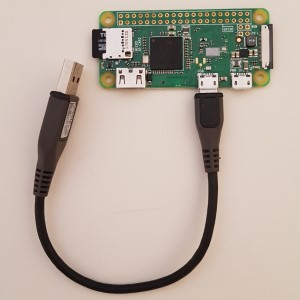

###### Universal Apple Keyboard USB Adapter

RaspiKey converts a bluetooth keyboard to a standard wired USB keyboard. It is particularly useful with the **Apple Wireless** keyboards because it translates their exotic keymap to that of a **standard PC** and makes them fully usable on a Windows PC or on other devices (TVs, game consoles, etc.).

RaspiKey requires a [Raspberry Pi Zero W](https://www.raspberrypi.org/products/raspberry-pi-zero-w/) hardware board.


Features
--------

* RaspiKey supports **any bluetooth keyboard** but it currently offers multimedia key support only for the Apple Wireless (A1314) and the Apple Magic (A1644) models. Furthermore, RaspiKey **can be used on any device** that accepts a standard USB keyboard. This means that you can use an Apple keyboard on a PC, a smart TV or on a game console.
* It does not require a driver installation or other software. It is also completely self-powered through the USB port.
* It is **secure**. As it is a hardware device, there is no software driver running on your PC that can be hacked, intercepted or compromised compared to a software solution. You have full access to its **source code** to review it, or even build it yourself.
* It is based on a cut-down, readonly version of the official Raspbian Linux. Even though it runs an OS internally, there is no need for a shutdown process, you just unplug it when you want.
* RaspiKey supports **Custom Keymaps**, allowing you to customise and remap keyboard keys.
* **Highly performant** compile-time optimised code written entirely in **C/C++**. Thanks to that, **Input latency** measurements with the Apple Wireless Keyboard achieved a minimum input latency of *11 msec*. Compared to [these](https://danluu.com/keyboard-latency/) results, the latency impact of RaspiKey is negligible.

Images
------

<a href="images/shot1.png"></a>
<a href="images/shot4.jpg"></a>


Hardware and Software Requirements
----------------------------------

1. A plain [Raspberry Pi Zero W](https://www.raspberrypi.org/products/raspberry-pi-zero-w/) board.
2. A 2GB (or bigger if not available) micro SD card.
3. Access to a modern Windows PC with a Web browser. You need this to build your new RaspiKey device and tether a Bluetooth keyboard to it for the first time.

Setting up a new RaspiKey Device
--------------------------------

1. Download and install [Etcher](https://etcher.io/).
2. Download the latest Raspios headless release **2020-08-20-raspios-buster-armhf-lite-headless.xz** from [here](https://github.com/samartzidis/RaspiKey/releases/tag/2020-08-20-raspios-buster-armhf-lite-headless).
3. Use **Etcher** to write the **2020-08-20-raspios-buster-armhf-lite-headless.xz** image to the SD card.
4. Download the latest RaspiKey release **raspikey-setup.*.zip** from [here](https://github.com/samartzidis/RaspiKey/releases).
5. Copy the **raspikey-setup.*.zip** (as-is) to the the SD card. The SD card should appear on Windows as a drive named **boot**.
6. Now insert the SD card to your **Raspberry Pi Zero W** device and connect it to the PC **using the middle micro-USB port** (labelled **USB** in tiny white letters).
7. The Pi will boot and continue its setup. This process lasts about 5-6 minutes. You will be able to tell when it's finished when the Raspberry Pi's **green led goes off** (it stays solid green during setup). Once that happens, unplug it from the PC's USB port.
8. Your new **RaspiKey** device is now fully configured and ready to use.

RaspiKey Use
------------

1. Connect (re-connect) your **RaspiKey** device to the PC **using the middle micro-USB port**. **Attention:** Please make sure that you are using a ***standard (data) micro USB cable*** and not a charging-only one, typically used by portable USB chargers, or your PC will not be abble to communicate with the RaspiKey.
2. Wait for about 10 seconds for it to start and open your PC Web browser at: **[http://169.254.1.1](http://169.254.1.1)**
3. Use the displayed configuration page to discover and connect a Bluetooth keyboard to it. Once the keyboard is connected, it will be usable on this PC directly or on anywhere else that you plug RaspiKey to. That is, you do not need to reconfigure RaspiKey to plug it in and use it elsewhere.


Known Issues
------------

*   The battery level indicator does not work on the Apple Magic (A1644) keyboard.

Apple Keyboards Keymap
----------------------

<table>
    <tr>
      <th>Input Key(s)</th>
      <th>Output Key</th>
    </tr>
    <tr>
      <td><kbd>LCtrl</kbd></td><td><kbd>Fn</kbd></td>
    </tr>
    <tr>
      <td><kbd>Fn</kbd></td><td><kbd>Left Ctrl</kbd></td>
    </tr>
    <tr>
      <td><kbd>⏏︎ Eject</kbd></td><td><kbd>Del</kbd></td>
    </tr>    
    <tr>
      <td><kbd>⌘ Cmd</kbd></td><td><kbd>Alt</kbd></td>
    </tr>    
    <tr>
      <td><kbd>⌥ Alt</kbd></td><td><kbd>Cmd</kbd></td>
    </tr>       
    <tr>
      <td><kbd>Fn</kbd>+<kbd>[F1]</kbd>...<kbd>[F6]</kbd></td><td><kbd>[F13]</kbd>...<kbd>[F18]</kbd></td>
    </tr>
    <tr>
      <td><kbd>Fn</kbd>+<kbd>[F7]</kbd>...<kbd>[F12]</kbd></td><td>Multimedia Keys</kbd></td>
    </tr>
    <tr>
      <td><kbd>Fn</kbd>+<kbd>LCtrl</kbd></td><td><kbd>Right Ctrl</kbd></td>
    </tr>
    <tr>
      <td><kbd>Fn</kbd>+<kbd>Return</kbd></td><td><kbd>Insert</kbd></td>
    </tr>
    <tr>
      <td><kbd>Fn</kbd>+<kbd>⌫</kbd></td><td><kbd>Del</kbd></td>
    </tr>
    <tr>
      <td><kbd>Fn</kbd>+<kbd>P</kbd></td><td><kbd>Print Screen</kbd></td>
    </tr>
    <tr>
      <td><kbd>Fn</kbd>+<kbd>S</kbd></td><td><kbd>Scroll Lock</kbd></td>
    </tr>
    <tr>
      <td><kbd>Fn</kbd>+<kbd>B</kbd></td><td><kbd>Pause/Break</kbd></td>
    </tr>
    <tr>
      <td><kbd>Fn</kbd>+<kbd>&uarr;</kbd></td><td><kbd>Page Up</kbd></td>
    </tr>
    <tr>
      <td><kbd>Fn</kbd>+<kbd>&darr;</kbd></td><td><kbd>Page Down</kbd></td>
    </tr>
    <tr>
      <td><kbd>Fn</kbd>+<kbd>&larr;</kbd></td><td><kbd>Home</kbd></td>
    </tr>
    <tr>
      <td><kbd>Fn</kbd>+<kbd>&rarr;</kbd></td><td><kbd>End</kbd></td>
    </tr>
  </table>

Custom Keymaps
--------------

You can use the configuration page to optionally upload a custom keymap JSON file. The file has to define an array of input key filters and output keys in the following format:

```json
[ 
  [input-modifier-mask, input-key-scancode, output-modifier-mask, output-key-scancode],
  ...
]
```

For instance a file such as this:

```json
[ 
  [null, "0x35", null, "0x64"],
  [null, "0x64", null, "0x35"]
]
```

will swap the following keys: **KEY_GRAVE - 0x35 (Keyboard ` and ~)** to **KEY_102ND 0x64 (Keyboard Non-US \ and |)**

The optional ***-modifier-mask** can be used to filter the *Ctrl*, *Shift* and *Alt* special key combinations if needed. If not used, you set it to *null* (as in the above example).

You can refer to [this](https://github.com/samartzidis/RaspiKey/blob/master/keymaps/usb_hid_keys.h) document to find out the HID scan codes of specific keys.

Examples:
- A Keymap for the **German** Apple keyboard versions so that all keys work as expected is available [here](https://raw.githubusercontent.com/samartzidis/RaspiKey/master/keymaps/de-keymap.json).

- A Keymap for the **UK** and **International English** versions is [here](https://raw.githubusercontent.com/samartzidis/RaspiKey/master/keymaps/en-uk-keymap.json). This keymap swaps the <kbd>`</kbd> key with the key below <kbd>Esc</kbd>.


---
RaspiKey is a free and open-source software effort. If you like it and find it useful, please consider donating

[](https://www.paypal.com/cgi-bin/webscr?cmd=_s-xclick&hosted_button_id=TBM5P9X6GZRCL)


